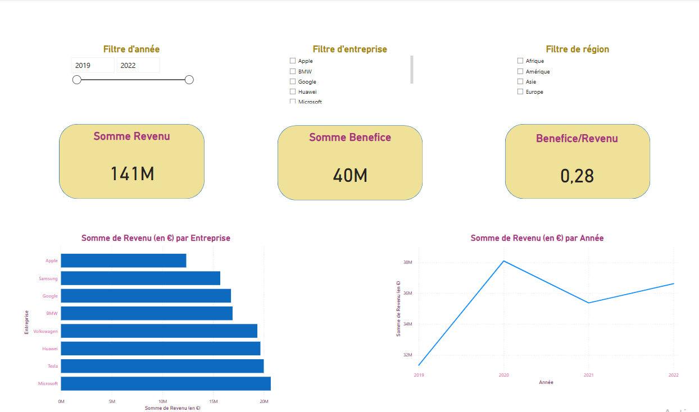
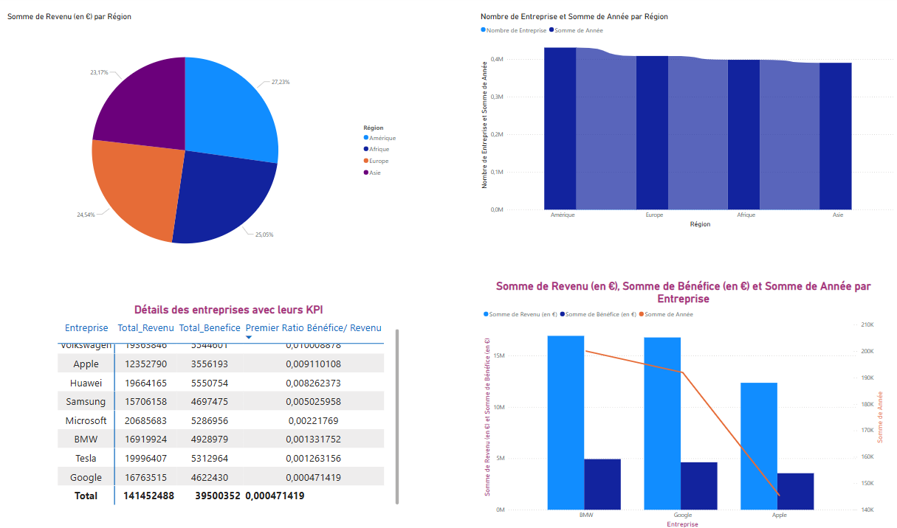
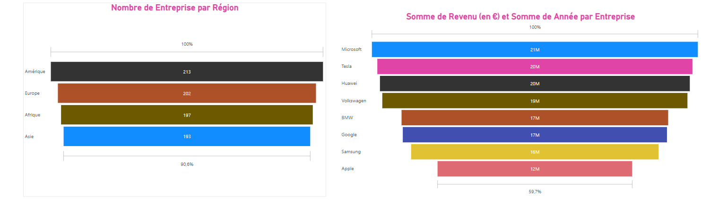

# Analyse Financière - Dashboard Power BI

Ce projet fournit un **template Power BI** pour analyser les données financières avec des métriques clés et des visuels interactifs. Il permet de charger un fichier CSV de transactions financières et de visualiser les tendances, les performances et les insights clés.

---

## 📁 Structure du Projet

- `dataset_finance.csv` : Exemple de dataset à utiliser avec ce template.
- `dashboard_finance.pbix` : Modèle Power BI prêt à l'emploi.
- `README.md` : Documentation du projet.

---

## 🛠️ Instructions d'utilisation

1. **Télécharger les fichiers nécessaires** :
   - Clonez ce dépôt :  
     ```bash
     git clone https://github.com/votre-utilisateur/votre-repo.git
     ```
   - Téléchargez le fichier `dashboard_finance.pbit`.

2. **Préparer vos données** :
   - Utilisez un fichier CSV contenant les colonnes suivantes :
     - `ID`, `Date`, `Catégorie`, `Description`, `Montant`, `Type`, `Devise`, `Région`.

3. **Charger le modèle dans Power BI** :
   - Ouvrez Power BI Desktop.
   - Chargez le fichier `dashboard_finance.pbit`.
   - Sélectionnez votre propre fichier CSV lors de l'importation.

---

## 🖼️ Aperçu du Dashboard





---

## 📝 Notes Techniques

- **Technologies utilisées** :
  - Power BI Desktop
  - DAX pour les mesures
  - Power Query pour le nettoyage des données

- **Personnalisations possibles** :
  - Ajoutez des colonnes calculées pour des insights spécifiques.
  - Connectez des sources de données en temps réel.

